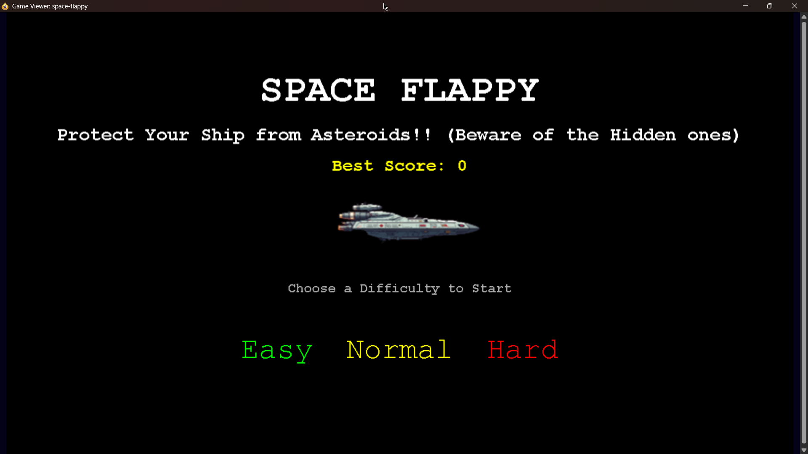
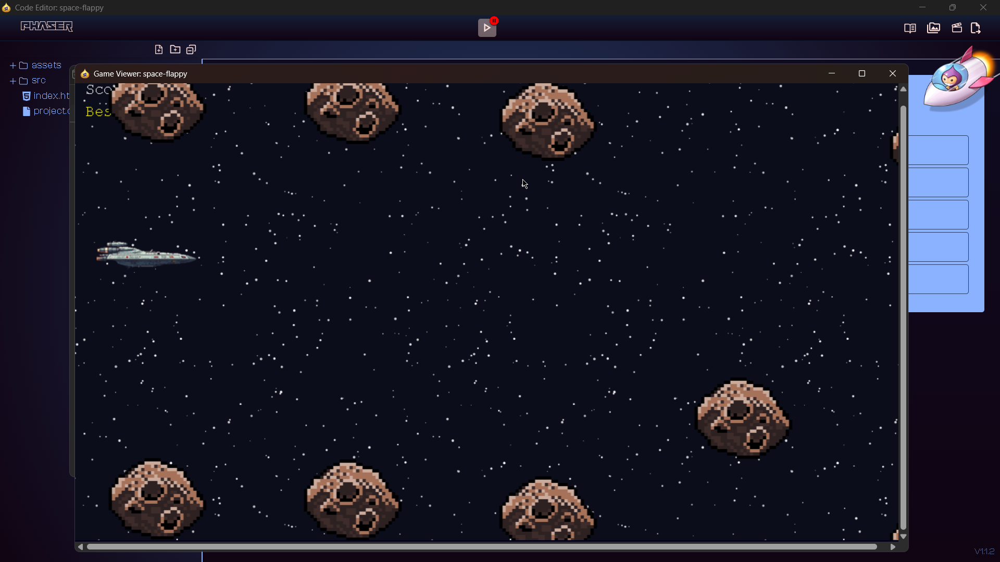
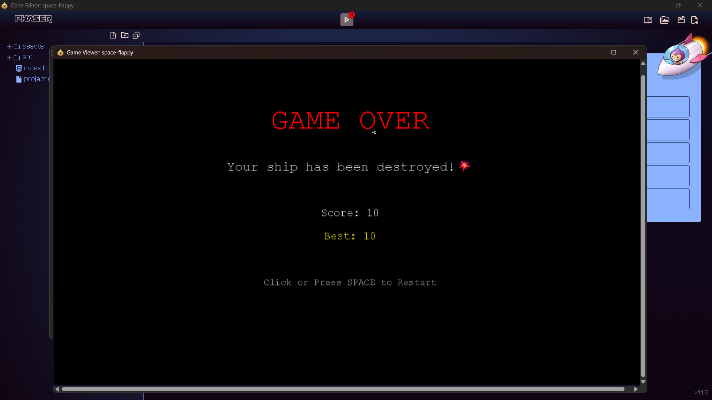

# 🚀 Space Flappy – A Galactic Twist on the Classic Flappy Bird


> **Protect your spaceship and dodge incoming asteroids in this thrilling space adventure!**
> My first-ever game built with **Phaser.js** using the **Phaser Editor**, featuring smooth animations, custom assets, and a space twist on the classic flappy bird gameplay.

---

## 🎮 Play Now!
🕹 **[Play Space Flappy on itch.io](https://artevious.itch.io/space-flappy)**

---

## ✨ Features
- 🌌 **Space Theme** – Fly a spaceship instead of a bird.
- ☄️ **Dynamic Obstacles** – Procedurally generated asteroids.
- 🎵 **Custom Sounds** – Flap, crash, score, and explosions.
- 🔥 **Three Difficulty Levels** – Easy, Normal, and Hard modes.
- 🏆 **Best Score Tracking** – Your highest score is saved locally.
- 📱 **Mobile Friendly** – Works on desktop & mobile browsers.

---

## 📸 Screenshots
| Start Menu | Gameplay | Game Over |
|------------|----------|-----------|
|  |  |  |

---

## 🕹 How to Play
1. **Tap or press SPACE** to make your spaceship flap.
2. **Avoid asteroids** – crashing ends the game.
3. **Pass through gaps** to earn points.
4. **Beat your best score!**

---

## 🛠 Tech Stack
- **Game Engine:** [Phaser 3](https://phaser.io/phaser3)
- **Editor:** [Phaser Editor 2D](https://phasereditor2d.com/)
- **Language:** JavaScript (ES6)
- **Hosting:** [itch.io](https://itch.io)

---

## 📂 Installation & Run Locally
```bash
# Clone the repository
git clone https://github.com/Abhinnapanditji/space-flappy.git

# Open in Phaser Editor 2D or any local server
# Example using npm's http-server:
npm install -g http-server
http-server .
```
📱 Mobile Support
-----------------

*   Works in **Chrome, Firefox, Edge, Safari**.

*   Responsive design ensures smooth gameplay on mobile.

*   Optimized touch controls for tapping.


📢 Connect with Me
------------------

💼 **LinkedIn:** [Abhinna Pandit](https://www.linkedin.com/in/abhinnapanditji)
🐙 **GitHub:** [AbhinnaPanditji](https://github.com/Abhinnapanditji)

### ⭐ If you enjoyed the game, please give the repo a star on GitHub!
